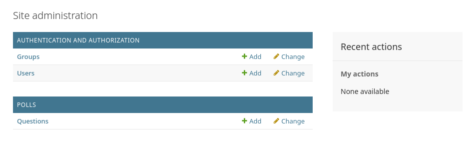

# Writing your first Django app

> This is a replica of the **Django Tutorial**. You can check on the [Django Documentation](https://docs.djangoproject.com/en/5.1/intro/)

## How to get Django
Django is available open-source under the BSD license. We recommend using the latest version of Python 3. The last version to support Python 2.7 is Django 1.11 LTS. See the FAQ for the Python versions supported by each version of Django. Here’s how to get it:

### Option 1: Get the latest official version
#### Linux / macOS:

>```
>python -m pip install Django==5.1.2
>```

#### Windows:

>```
>py -m pip install Django==5.1.2
>```

### Option 2: Get the latest development version
The latest and greatest Django version is the one that’s in our Git repository (our revision-control system). This is only for experienced users who want to try incoming changes and help identify bugs before an official release. Get it using this shell command, which requires [Git](https://git-scm.com/):

>```
>git clone https://github.com/django/django.git
>```

## Set up a database
This step is only necessary if you’d like to work with a “large” database engine like PostgreSQL, MariaDB, MySQL, or Oracle. To install such a database, consult the [database installation information](https://docs.djangoproject.com/en/5.1/topics/install/#database-installation).


# [Part 1](https://docs.djangoproject.com/en/5.1/intro/tutorial01/)

Let’s learn by example.

Throughout this tutorial, we’ll walk you through the creation of a basic poll application.

It’ll consist of two parts:

- A public site that lets people view polls and vote in them.
- An admin site that lets you add, change, and delete polls.

We’ll assume you have [Django installed](https://docs.djangoproject.com/en/5.1/intro/install/) already. You can tell Django is installed and which version by running the following command in a shell prompt:

>```
>python -m django --version
>```

If Django is installed, you should see the version of your installation. If it isn’t, you’ll get an error telling “No module named django”.

This tutorial is written for Django 5.1, which supports Python 3.10 and later. If the Django version doesn’t match, you can refer to the tutorial for your version of Django by using the version switcher at the bottom right corner of this page, or update Django to the newest version. If you’re using an older version of Python, check [What Python version can I use with Django?](https://docs.djangoproject.com/en/5.1/faq/install/#faq-python-version-support) to find a compatible version of Django.

See [How to install Django](https://docs.djangoproject.com/en/5.1/topics/install/) for advice on how to remove older versions of Django and install a newer one.

## Creating a project

From the command line, cd into a directory where you’d like to store your code and create a new directory named **djangotutorial**. (This directory name doesn’t matter to Django; you can rename it to anything you like.)

>```
>mkdir djangotutorial
>```

Then, run the following command to bootstrap a new Django project:

>```
>django-admin startproject mysite djangotutorial
>```

This will create a project called mysite inside the djangotutorial directory. If it didn’t work, see [Problems running django-admin](https://docs.djangoproject.com/en/5.1/faq/troubleshooting/#troubleshooting-django-admin).

Let’s look at what startproject created:
```
djangotutorial/
    manage.py
    mysite/
        __init__.py
        settings.py
        urls.py
        asgi.py
        wsgi.py
```
These files are:

- **manage.py**: A command-line utility that lets you interact with this Django project in various ways. You can read all the details about manage.py in [django-admin and manage.py](https://docs.djangoproject.com/en/5.1/ref/django-admin/).
- **mysite/**: A directory that is the actual Python package for your project. Its name is the Python package name you’ll need to use to import anything inside it (e.g. **mysite.urls**).
- **mysite/\_\_init\_\_.py**: An empty file that tells Python that this directory should be considered a Python package. If you’re a Python beginner, read [more about packages](https://docs.python.org/3/tutorial/modules.html#tut-packages) in the official Python docs.
- **mysite/settings.py**: Settings/configuration for this Django project. [Django settings](https://docs.djangoproject.com/en/5.1/topics/settings/) will tell you all about how settings work.
- **mysite/urls.py**: The URL declarations for this Django project; a “table of contents” of your Django-powered site. You can read more about URLs in [URL dispatcher](https://docs.djangoproject.com/en/5.1/topics/http/urls/).
- **mysite/asgi.py**: An entry-point for ASGI-compatible web servers to serve your project. See [How to deploy with ASGI](https://docs.djangoproject.com/en/5.1/howto/deployment/asgi/) for more details.
- **mysite/wsgi.py**: An entry-point for WSGI-compatible web servers to serve your project. See [How to deploy with WSGI](https://docs.djangoproject.com/en/5.1/howto/deployment/wsgi/) for more details.


## The development server
Let’s verify your Django project works. Change into the djangotutorial directory, if you haven’t already, and run the following commands:

>```
>python manage.py runserver
>```

You’ll see the following output on the command line:
```
Performing system checks...

System check identified no issues (0 silenced).

You have unapplied migrations; your app may not work properly until they are applied.
Run 'python manage.py migrate' to apply them.

October 14, 2024 - 15:50:53
Django version 5.1, using settings 'mysite.settings'
Starting development server at http://127.0.0.1:8000/
Quit the server with CONTROL-C.
```

Now that the server’s running, visit http://127.0.0.1:8000/ with your web browser. You’ll see a “Congratulations!” page, with a rocket taking off. It worked!

To run the server on port 8001, you can use the following command:

>```
>python manage.py runserver 8001
>```

## Creating the Polls app
Now that your environment – a “project” – is set up, you’re set to start doing work.

Each application you write in Django consists of a Python package that follows a certain convention. Django comes with a utility that automatically generates the basic directory structure of an app, so you can focus on writing code rather than creating directories.

> #### Projects vs. apps:
> What’s the difference between a project and an app? An app is a web application that does something – e.g., a blog system, a database of public records or a small poll app. A project is a collection of configuration and apps for a particular website. A project can contain multiple apps. An app can be in multiple projects.

To create your app, make sure you’re in the same directory as manage.py and type this command:

>```
> python manage.py startapp polls
>```

That’ll create a directory **polls**, which is laid out like this:

```
polls/
    __init__.py
    admin.py
    apps.py
    migrations/
        __init__.py
    models.py
    tests.py
    views.py
```

This directory structure will house the poll application.

## Write your first view
Let’s write the first view. Open the file polls/views.py and put the following Python code in it:

> #### polls/views.py
>```py
>from django.http import HttpResponse
>
>
>def index(request):
>    return HttpResponse("Hello, world. You're at the polls index.")
>```

This is the most basic view possible in Django. To access it in a browser, we need to map it to a URL - and for this we need to define a URL configuration, or “URLconf” for short. These URL configurations are defined inside each Django app, and they are Python files named **urls.py**.

To define a URLconf for the **polls** app, create a file **polls/urls.py** with the following content:

> #### polls/urls.py
>```py
>from django.urls import path
>
>from . import views
>
>urlpatterns = [
>    path("", views.index, name="index"),
>]
>```

Your app directory should now look like:
```
polls/
    __init__.py
    admin.py
    apps.py
    migrations/
        __init__.py
    models.py
    tests.py
    urls.py
    views.py
```

The next step is to configure the global URLconf in the **mysite** project to include the URLconf defined in **polls.urls**. To do this, add an import for **django.urls.include** in **mysite/urls.py** and insert an **include()** in the **urlpatterns** list, so you have:

> #### mysite/urls.py
>```py
>from django.contrib import admin
>from django.urls import include, path
>
>urlpatterns = [
>    path("polls/", include("polls.urls")),
>    path("admin/", admin.site.urls),
>]
>```

The **[path()](https://docs.djangoproject.com/en/5.1/ref/urls/#django.urls.path)** function expects at least two arguments: **route** and **view**. The **include()** function allows referencing other URLconfs. Whenever Django encounters **[include()](https://docs.djangoproject.com/en/5.1/ref/urls/#django.urls.include)**, it chops off whatever part of the URL matched up to that point and sends the remaining string to the included URLconf for further processing.

The idea behind **include()** is to make it easy to plug-and-play URLs. Since polls are in their own URLconf (**polls/urls.py**), they can be placed under “/polls/”, or under “/fun_polls/”, or under “/content/polls/”, or any other path root, and the app will still work.

> #### When to use [include()](https://docs.djangoproject.com/en/5.1/ref/urls/#django.urls.include)
> You should always use include() when you include other URL patterns. The only exception is admin.site.urls, which is a pre-built URLconf provided by Django for the default admin site.

You have now wired an index view into the URLconf. Verify it’s working with the following command:

> ```
> python manage.py runserver
>```

Go to http://localhost:8000/polls/ in your browser, and you should see the text *“Hello, world. You’re at the polls index.”*, which you defined in the index view.

# [Part 2](https://docs.djangoproject.com/en/5.1/intro/tutorial02/)

## Database setup

Now, open up **mysite/settings.py**. It’s a normal Python module with module-level variables representing Django settings.

By default, the **[DATABASES](https://docs.djangoproject.com/en/5.1/ref/settings/#std-setting-DATABASES)** configuration uses SQLite. If you’re new to databases, or you’re just interested in trying Django, this is the easiest choice. SQLite is included in Python, so you won’t need to install anything else to support your database. When starting your first real project, however, you may want to use a more scalable database like PostgreSQL, to avoid database-switching headaches down the road.

If you wish to use another database, see [details to customize and get your database running](https://docs.djangoproject.com/en/5.1/topics/install/#database-installation).

While you’re editing **mysite/settings.py**, set **[TIME_ZONE](https://docs.djangoproject.com/en/5.1/ref/settings/#std-setting-TIME_ZONE)** to your time zone.

Also, note the **[INSTALLED_APPS](https://docs.djangoproject.com/en/5.1/ref/settings/#std-setting-INSTALLED_APPS)** setting at the top of the file. That holds the names of all Django applications that are activated in this Django instance. Apps can be used in multiple projects, and you can package and distribute them for use by others in their projects.

By default, INSTALLED_APPS contains the following apps, all of which come with Django:
- **[django.contrib.admin](https://docs.djangoproject.com/en/5.1/ref/contrib/admin/#module-django.contrib.admin)** – The admin site. You’ll use it shortly.
- **[django.contrib.auth](https://docs.djangoproject.com/en/5.1/topics/auth/#module-django.contrib.auth)** – An authentication system.
- **[django.contrib.contenttypes](https://docs.djangoproject.com/en/5.1/ref/contrib/contenttypes/#module-django.contrib.contenttypes)** – A framework for content types.
- **[django.contrib.sessions](https://docs.djangoproject.com/en/5.1/topics/http/sessions/#module-django.contrib.sessions)** – A session framework.
- **[django.contrib.messages](https://docs.djangoproject.com/en/5.1/ref/contrib/messages/#module-django.contrib.messages)** – A messaging framework.
- **[django.contrib.staticfiles](https://docs.djangoproject.com/en/5.1/ref/contrib/staticfiles/#module-django.contrib.staticfiles)** – A framework for managing static files.
These applications are included by default as a convenience for the common case.

Some of these applications make use of at least one database table, though, so we need to create the tables in the database before we can use them. To do that, run the following command:

>```
>python manage.py migrate
>```

The **migrate** command looks at the **[INSTALLED_APPS](https://docs.djangoproject.com/en/5.1/ref/settings/#std-setting-INSTALLED_APPS)** setting and creates any necessary database tables according to the database settings in your **mysite/settings.py** file and the database migrations shipped with the app (we’ll cover those later). You’ll see a message for each migration it applies. If you’re interested, run the command-line client for your database and type **\dt** (PostgreSQL), **SHOW TABLES**; (MariaDB, MySQL), **.tables** (SQLite), or **SELECT TABLE_NAME FROM USER_TABLES;** (Oracle) to display the tables Django created.

## Creating models

Now we’ll define your models – essentially, your database layout, with additional metadata.

> #### Philosophy
> A model is the single, definitive source of information about your data. It contains the essential fields and behaviors of the data you’re storing. Django follows the [DRY Principle](https://docs.djangoproject.com/en/5.1/misc/design-philosophies/#dry). The goal is to define your data model in one place and automatically derive things from it.
>
> This includes the migrations - unlike in Ruby On Rails, for example, migrations are entirely derived from your models file, and are essentially a history that Django can roll through to update your database schema to match your current models.

In our poll app, we’ll create two models: **Question** and **Choice**. A Question has a question and a publication date. A **Choice** has two fields: the text of the choice and a vote tally. Each Choice is associated with a **Question**.

These concepts are represented by Python classes. Edit the **polls/models.py** file so it looks like this:

> #### polls/models.py
>```py
>from django.db import models
>
>
>class Question(models.Model):
>    question_text = models.CharField(max_length=200)
>    pub_date = models.DateTimeField("date published")
>
>
>class Choice(models.Model):
>    question = models.ForeignKey(Question, on_delete=models.CASCADE)
>    choice_text = models.CharField(max_length=200)
>    votes = models.IntegerField(default=0)
>```

Here, each model is represented by a class that subclasses **[django.db.models.Model](https://docs.djangoproject.com/en/5.1/ref/models/instances/#django.db.models.Model)**. Each model has a number of class variables, each of which represents a database field in the model.

Each field is represented by an instance of a **[Field](https://docs.djangoproject.com/en/5.1/ref/models/fields/#django.db.models.Field)** class – e.g., **[CharField](https://docs.djangoproject.com/en/5.1/ref/models/fields/#django.db.models.CharField)** for character fields and **[DateTimeField](https://docs.djangoproject.com/en/5.1/ref/models/fields/#django.db.models.DateTimeField)** for datetimes. This tells Django what type of data each field holds.

The name of each **[Field](https://docs.djangoproject.com/en/5.1/ref/models/fields/#django.db.models.Field)** instance (e.g. **question_text** or **pub_date**) is the field’s name, in machine-friendly format. You’ll use this value in your Python code, and your database will use it as the column name.

You can use an optional first positional argument to a **[Field](https://docs.djangoproject.com/en/5.1/ref/models/fields/#django.db.models.Field)** to designate a human-readable name. That’s used in a couple of introspective parts of Django, and it doubles as documentation. If this field isn’t provided, Django will use the machine-readable name. In this example, we’ve only defined a human-readable name for **Question.pub_date**. For all other fields in this model, the field’s machine-readable name will suffice as its human-readable name.

Some **[Field](https://docs.djangoproject.com/en/5.1/ref/models/fields/#django.db.models.Field)** classes have required arguments. **[CharField](https://docs.djangoproject.com/en/5.1/ref/models/fields/#django.db.models.CharField)**, for example, requires that you give it a **[max_length](https://docs.djangoproject.com/en/5.1/ref/models/fields/#django.db.models.CharField.max_length)**. That’s used not only in the database schema, but in validation, as we’ll soon see.

A **[Field](https://docs.djangoproject.com/en/5.1/ref/models/fields/#django.db.models.Field)** can also have various optional arguments; in this case, we’ve set the **[default](https://docs.djangoproject.com/en/5.1/ref/models/fields/#django.db.models.Field.default)** value of **votes** to 0.

Finally, note a relationship is defined, using **[ForeignKey](https://docs.djangoproject.com/en/5.1/ref/models/fields/#django.db.models.ForeignKey)**. That tells Django each **Choice** is related to a single Question. Django supports all the common database relationships: many-to-one, many-to-many, and one-to-one.

## Activating models
That small bit of model code gives Django a lot of information. With it, Django is able to:

- Create a database schema (**CREATE TABLE** statements) for this app.
- Create a Python database-access API for accessing **Question** and **Choice** objects.

But first we need to tell our project that the **polls** app is installed.

To include the app in our project, we need to add a reference to its configuration class in the **[INSTALLED_APPS](https://docs.djangoproject.com/en/5.1/ref/settings/#std-setting-INSTALLED_APPS)** setting. The **PollsConfig** class is in the **polls/apps.py** file, so its dotted path is **'polls.apps.PollsConfig'**. Edit the **mysite/settings.py** file and add that dotted path to the **[INSTALLED_APPS](https://docs.djangoproject.com/en/5.1/ref/settings/#std-setting-INSTALLED_APPS)** setting. It’ll look like this:


> #### polls/settings.py
>```py
>INSTALLED_APPS = [
>    "polls.apps.PollsConfig",
>    "django.contrib.admin",
>    "django.contrib.auth",
>    "django.contrib.contenttypes",
>    "django.contrib.sessions",
>    "django.contrib.messages",
>    "django.contrib.staticfiles",
>]
>```

Now Django knows to include the polls app. Let’s run another command:

>```
>python manage.py makemigrations polls
>```

You should see something similar to the following:

```
Migrations for 'polls':
  polls/migrations/0001_initial.py
    + Create model Question
    + Create model Choice
```

By running **makemigrations**, you’re telling Django that you’ve made some changes to your models (in this case, you’ve made new ones) and that you’d like the changes to be stored as a migration.

Migrations are how Django stores changes to your models (and thus your database schema) - they’re files on disk. You can read the migration for your new model if you like; it’s the file **polls/migrations/0001_initial.py**. Don’t worry, you’re not expected to read them every time Django makes one, but they’re designed to be human-editable in case you want to manually tweak how Django changes things.

There’s a command that will run the migrations for you and manage your database schema automatically - that’s called **[migrate](https://docs.djangoproject.com/en/5.1/ref/django-admin/#django-admin-migrate)**, and we’ll come to it in a moment - but first, let’s see what SQL that migration would run. The **[sqlmigrate](https://docs.djangoproject.com/en/5.1/ref/django-admin/#django-admin-sqlmigrate)** command takes migration names and returns their SQL:

>```
>python manage.py sqlmigrate polls 0001
>```

You should see something similar to the following (we’ve reformatted it for readability):

```sql
BEGIN;
--
-- Create model Question
--
CREATE TABLE "polls_question" (
    "id" bigint NOT NULL PRIMARY KEY GENERATED BY DEFAULT AS IDENTITY,
    "question_text" varchar(200) NOT NULL,
    "pub_date" timestamp with time zone NOT NULL
);
--
-- Create model Choice
--
CREATE TABLE "polls_choice" (
    "id" bigint NOT NULL PRIMARY KEY GENERATED BY DEFAULT AS IDENTITY,
    "choice_text" varchar(200) NOT NULL,
    "votes" integer NOT NULL,
    "question_id" bigint NOT NULL
);
ALTER TABLE "polls_choice"
  ADD CONSTRAINT "polls_choice_question_id_c5b4b260_fk_polls_question_id"
    FOREIGN KEY ("question_id")
    REFERENCES "polls_question" ("id")
    DEFERRABLE INITIALLY DEFERRED;
CREATE INDEX "polls_choice_question_id_c5b4b260" ON "polls_choice" ("question_id");

COMMIT;
```

Note the following:
- The exact output will vary depending on the database you are using. The example above is generated for PostgreSQL.
- Table names are automatically generated by combining the name of the app (**polls**) and the lowercase name of the model – **question** and **choice**. (You can override this behavior.)
- Primary keys (IDs) are added automatically. (You can override this, too.)
- By convention, Django appends **"_id"** to the foreign key field name. (Yes, you can override this, as well.)
- The foreign key relationship is made explicit by a **FOREIGN KEY** constraint. Don’t worry about the **DEFERRABLE** parts; it’s telling PostgreSQL to not enforce the foreign key until the end of the transaction.
- It’s tailored to the database you’re using, so database-specific field types such as **auto_increment** (MySQL), **bigint PRIMARY KEY GENERATED BY DEFAULT AS IDENTITY** (PostgreSQL), or **integer primary key autoincrement** (SQLite) are handled for you automatically. Same goes for the quoting of field names – e.g., using double quotes or single quotes.
- The **[sqlmigrate](https://docs.djangoproject.com/en/5.1/ref/django-admin/#django-admin-sqlmigrate)** command doesn’t actually run the migration on your database - instead, it prints it to the screen so that you can see what SQL Django thinks is required. It’s useful for checking what Django is going to do or if you have database administrators who require SQL scripts for changes.

If you’re interested, you can also run **[python manage.py check](https://docs.djangoproject.com/en/5.1/ref/django-admin/#django-admin-check)**; this checks for any problems in your project without making migrations or touching the database.

Now, run **[migrate](https://docs.djangoproject.com/en/5.1/ref/django-admin/#django-admin-migrate)** again to create those model tables in your database:

```
python manage.py migrate
Operations to perform:
  Apply all migrations: admin, auth, contenttypes, polls, sessions
Running migrations:
  Rendering model states... DONE
  Applying polls.0001_initial... OK
```

The **[migrate](https://docs.djangoproject.com/en/5.1/ref/django-admin/#django-admin-migrate)** command takes all the migrations that haven’t been applied (Django tracks which ones are applied using a special table in your database called **django_migrations**) and runs them against your database - essentially, synchronizing the changes you made to your models with the schema in the database.

Migrations are very powerful and let you change your models over time, as you develop your project, without the need to delete your database or tables and make new ones - it specializes in upgrading your database live, without losing data. We’ll cover them in more depth in a later part of the tutorial, but for now, remember the three-step guide to making model changes:

- Change your models (in **models.py**).
- Run **[python manage.py makemigrations](https://docs.djangoproject.com/en/5.1/ref/django-admin/#django-admin-makemigrations)** to create migrations for those changes
- Run **[python manage.py migrate](https://docs.djangoproject.com/en/5.1/ref/django-admin/#django-admin-migrate)** to apply those changes to the database.

The reason that there are separate commands to make and apply migrations is because you’ll commit migrations to your version control system and ship them with your app; they not only make your development easier, they’re also usable by other developers and in production.

Read the [django-admin documentation](https://docs.djangoproject.com/en/5.1/ref/django-admin/) for full information on what the **manage.py** utility can do.

## Playing with the API

Now, let’s hop into the interactive Python shell and play around with the free API Django gives you. To invoke the Python shell, use this command:

>```
>python manage.py shell
>```

We’re using this instead of simply typing “python”, because **manage.py** sets the **[DJANGO_SETTINGS_MODULE](https://docs.djangoproject.com/en/5.1/topics/settings/#envvar-DJANGO_SETTINGS_MODULE)** environment variable, which gives Django the Python import path to your **mysite/settings.py** file.

Once you’re in the shell, explore the **[database API](https://docs.djangoproject.com/en/5.1/topics/db/queries/)**:

```py
>>> from polls.models import Choice, Question  # Import the model classes we just wrote.

# No questions are in the system yet.
>>> Question.objects.all()
<QuerySet []>

# Create a new Question.
# Support for time zones is enabled in the default settings file, so
# Django expects a datetime with tzinfo for pub_date. Use timezone.now()
# instead of datetime.datetime.now() and it will do the right thing.
>>> from django.utils import timezone
>>> q = Question(question_text="What's new?", pub_date=timezone.now())

# Save the object into the database. You have to call save() explicitly.
>>> q.save()

# Now it has an ID.
>>> q.id
1

# Access model field values via Python attributes.
>>> q.question_text
"What's new?"
>>> q.pub_date
datetime.datetime(2012, 2, 26, 13, 0, 0, 775217, tzinfo=datetime.timezone.utc)

# Change values by changing the attributes, then calling save().
>>> q.question_text = "What's up?"
>>> q.save()

# objects.all() displays all the questions in the database.
>>> Question.objects.all()
<QuerySet [<Question: Question object (1)>]>

```

Wait a minute. **<Question: Question object (1)>** isn’t a helpful representation of this object. Let’s fix that by editing the **Question** model (in the **polls/models.py** file) and adding a **\_\_str\_\_()** method to both **Question** and **Choice**:

> #### polls/models.py
>```py
>from django.db import models
>
>
>class Question(models.Model):
>    # ...
>    def __str__(self):
>        return self.question_text
>
>
>class Choice(models.Model):
>    # ...
>    def __str__(self):
>        return self.choice_text
>```

It’s important to add **\_\_str\_\_()** methods to your models, not only for your own convenience when dealing with the interactive prompt, but also because objects’ representations are used throughout Django’s automatically-generated admin.

Let’s also add a custom method to this model:

> #### polls/models.py
>```py
>import datetime
>
>from django.db import models
>from django.utils import timezone
>
>
>class Question(models.Model):
>    # ...
>    def was_published_recently(self):
>        return self.pub_date >= timezone.now() - datetime.timedelta(days=1)
>```

Note the addition of **import datetime** and **from django.utils import timezone**, to reference Python’s standard **[datetime](https://docs.python.org/3/library/datetime.html#module-datetime)** module and Django’s time-zone-related utilities in **[django.utils.timezone](https://docs.djangoproject.com/en/5.1/ref/utils/#module-django.utils.timezone)**, respectively. If you aren’t familiar with time zone handling in Python, you can learn more in the [time zone support docs](https://docs.djangoproject.com/en/5.1/topics/i18n/timezones/).

Save these changes and start a new Python interactive shell by running **python manage.py shell** again:

```py
>>> from polls.models import Choice, Question

# Make sure our __str__() addition worked.
>>> Question.objects.all()
<QuerySet [<Question: What's up?>]>

# Django provides a rich database lookup API that's entirely driven by
# keyword arguments.
>>> Question.objects.filter(id=1)
<QuerySet [<Question: What's up?>]>
>>> Question.objects.filter(question_text__startswith="What")
<QuerySet [<Question: What's up?>]>

# Get the question that was published this year.
>>> from django.utils import timezone
>>> current_year = timezone.now().year
>>> Question.objects.get(pub_date__year=current_year)
<Question: What's up?>

# Request an ID that doesn't exist, this will raise an exception.
>>> Question.objects.get(id=2)
Traceback (most recent call last):
    ...
DoesNotExist: Question matching query does not exist.

# Lookup by a primary key is the most common case, so Django provides a
# shortcut for primary-key exact lookups.
# The following is identical to Question.objects.get(id=1).
>>> Question.objects.get(pk=1)
<Question: What's up?>

# Make sure our custom method worked.
>>> q = Question.objects.get(pk=1)
>>> q.was_published_recently()
True

# Give the Question a couple of Choices. The create call constructs a new
# Choice object, does the INSERT statement, adds the choice to the set
# of available choices and returns the new Choice object. Django creates
# a set (defined as "choice_set") to hold the "other side" of a ForeignKey
# relation (e.g. a question's choice) which can be accessed via the API.
>>> q = Question.objects.get(pk=1)

# Display any choices from the related object set -- none so far.
>>> q.choice_set.all()
<QuerySet []>

# Create three choices.
>>> q.choice_set.create(choice_text="Not much", votes=0)
<Choice: Not much>
>>> q.choice_set.create(choice_text="The sky", votes=0)
<Choice: The sky>
>>> c = q.choice_set.create(choice_text="Just hacking again", votes=0)

# Choice objects have API access to their related Question objects.
>>> c.question
<Question: What's up?>

# And vice versa: Question objects get access to Choice objects.
>>> q.choice_set.all()
<QuerySet [<Choice: Not much>, <Choice: The sky>, <Choice: Just hacking again>]>
>>> q.choice_set.count()
3

# The API automatically follows relationships as far as you need.
# Use double underscores to separate relationships.
# This works as many levels deep as you want; there's no limit.
# Find all Choices for any question whose pub_date is in this year
# (reusing the 'current_year' variable we created above).
>>> Choice.objects.filter(question__pub_date__year=current_year)
<QuerySet [<Choice: Not much>, <Choice: The sky>, <Choice: Just hacking again>]>

# Let's delete one of the choices. Use delete() for that.
>>> c = q.choice_set.filter(choice_text__startswith="Just hacking")
>>> c.delete()
```

For more information on model relations, see [Accessing related objects](https://docs.djangoproject.com/en/5.1/ref/models/relations/). For more on how to use double underscores to perform [field lookups](https://docs.djangoproject.com/en/5.1/topics/db/queries/#field-lookups-intro) via the API, see Field lookups. For full details on the database API, see our [Database API reference](https://docs.djangoproject.com/en/5.1/topics/db/queries/).

## Introducing the Django Admin

> #### Philosophy
>
> Generating admin sites for your staff or clients to add, change, and delete content is tedious work that doesn’t require much creativity. For that reason, Django entirely automates creation of admin interfaces for models.
>
> Django was written in a newsroom environment, with a very clear separation between “content publishers” and the “public” site. Site managers use the system to add news stories, events, sports scores, etc., and that content is displayed on the public site. Django solves the problem of creating a unified interface for site administrators to edit content.
>
>The admin isn’t intended to be used by site visitors. It’s for site managers.

### Creating an admin user

First we’ll need to create a user who can login to the admin site. Run the following command:

>```
>python manage.py createsuperuser
>```

Enter your desired username and press enter.

>```
>Username: admin
>```

You will then be prompted for your desired email address:

>```
>Email address: admin@example.com
>```

The final step is to enter your password. You will be asked to enter your password twice, the second time as a confirmation of the first.

>```
>Password: **********
>Password (again): *********
>Superuser created successfully.
>```

### Start the development server

Now, open a web browser and go to “/admin/” on your local domain – e.g., http://127.0.0.1:8000/admin/. You should see the admin’s login screen:


Since [translation](https://docs.djangoproject.com/en/5.1/topics/i18n/translation/) is turned on by default, if you set **[LANGUAGE_CODE](https://docs.djangoproject.com/en/5.1/ref/settings/#std-setting-LANGUAGE_CODE)**, the login screen will be displayed in the given language (if Django has appropriate translations).

### Enter the admin site

Now, try logging in with the superuser account you created in the previous step. You should see the Django admin index page:


You should see a few types of editable content: groups and users. They are provided by **[django.contrib.auth](https://docs.djangoproject.com/en/5.1/topics/auth/#module-django.contrib.auth)**, the authentication framework shipped by Django.

### Make the poll app modifiable in the admin

But where’s our poll app? It’s not displayed on the admin index page.

Only one more thing to do: we need to tell the admin that **Question** objects have an admin interface. To do this, open the **polls/admin.py** file, and edit it to look like this:

> #### polls/admin.py
>```py
>from django.contrib import admin
>
>from .models import Question
>
>admin.site.register(Question)
>```

### Explore the free admin functionality

Now that we’ve registered **Question**, Django knows that it should be displayed on the admin index page:



Click “Questions”. Now you’re at the “change list” page for questions. This page displays all the questions in the database and lets you choose one to change it. There’s the “What’s up?” question we created earlier:


Click the “What’s up?” question to edit it:


Things to note here:

- The form is automatically generated from the **Question** model.
- The different model field types **[DateTimeField](https://docs.djangoproject.com/en/5.1/ref/models/fields/#django.db.models.DateTimeField)**, **[CharField](https://docs.djangoproject.com/en/5.1/ref/models/fields/#django.db.models.CharField)** correspond to the appropriate HTML input widget. Each type of field knows how to display itself in the Django admin.
- Each **[DateTimeField](https://docs.djangoproject.com/en/5.1/ref/models/fields/#django.db.models.DateTimeField)** gets free JavaScript shortcuts. Dates get a “Today” shortcut and calendar popup, and times get a “Now” shortcut and a convenient popup that lists commonly entered times.

The bottom part of the page gives you a couple of options:

- Save – Saves changes and returns to the change-list page for this type of object.
- Save and continue editing – Saves changes and reloads the admin page for this object.
- Save and add another – Saves changes and loads a new, blank form for this type of object.
- Delete – Displays a delete confirmation page.

If the value of “Date published” doesn’t match the time when you created the question in [Tutorial 1](https://docs.djangoproject.com/en/5.1/intro/tutorial01/), it probably means you forgot to set the correct value for the **[TIME_ZONE](https://docs.djangoproject.com/en/5.1/ref/settings/#std-setting-TIME_ZONE)** setting. Change it, reload the page and check that the correct value appears.

Change the “Date published” by clicking the “Today” and “Now” shortcuts. Then click “Save and continue editing.” Then click “History” in the upper right. You’ll see a page listing all changes made to this object via the Django admin, with the timestamp and username of the person who made the change:


When you’re comfortable with the models API and have familiarized yourself with the admin site, read part 3 of this tutorial to learn about how to add more views to our polls app.

# [Part 3](https://docs.djangoproject.com/en/5.1/intro/tutorial03/)

- TODO


## References
- [Django Documentation](https://docs.djangoproject.com/en/5.1/)
  
## License

